#  D+IO Project
**パナソニック株式会社/FUTURE LIFE FACTORY**
<br>D+IOプロジェクトは、人間が本来備え持っている創造力をエンパワーするプロジェクトです。
### [D+IO プロジェクト詳細](https://panasonic.co.jp/design/flf/works/doing_io/)
<a href="https://panasonic.co.jp/design/flf/works/doing_io/"></a>

<br><br>

## 【D+IO PRODUCT 第2弾】小動物ヘルスケアデバイス
第2弾は、小さなペットの活動量や体重、飼育する環境の温度・湿度などが測定できる「小動物ヘルスケアデバイス」です。

**ソースコードは別リポジトリです**
<br>[https://github.com/panasonic-corporation/doingio-small-pets-healthcare](https://github.com/panasonic-corporation/doingio-small-pets-healthcare)

<br>

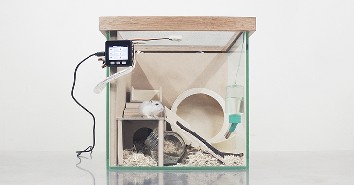

<br><br>
新型コロナウイルス感染症の感染拡大に伴い、自宅で過ごす時間が長くなったことによりペットを飼う人が増えたと言われています。なかでも、ハムスターや小鳥などの小動物は飼育しやすいことから人気を集めています。<br><br>ところが犬や猫用に比べ、小動物用のヘルスケア製品は市場に多く出回っていないのが現状です。<br><br>ハムスターにおいては、夜行性で日中は寝ていることが多く、病気にかかっていたとしても症状が早期に見つかりにくいと言われています。また、室温や湿度の変化が健康に影響を与えてしまうという課題があります。
<br><br>こうした課題を解消すべく、「小動物ヘルスケアデバイス」のレシピを考案し公開することにしました。愛情を持って接する大切な小動物に、ヘルスケアデバイスを実際に使っているシーンを想像しながら、モノづくりを通じて、今の困難な状況を乗り越えるための一助になればと考えています。


<br><br><br><br>
# 作り方


## 作り方動画も公開しています
<a href="https://www.youtube.com/watch?v=cGIyTFu6GVQ"></a>


## 1.準備
必要なパーツを用意

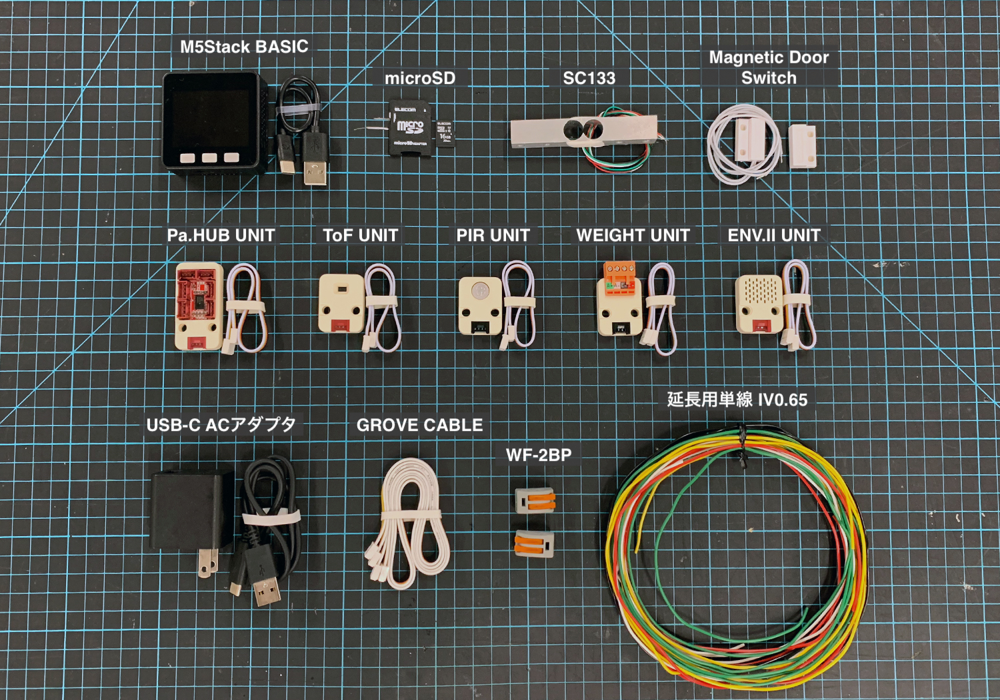

| NO | パーツ | 画像 | 用途 | リンク | 備考 |
|:--|:--|:--:|:--|:--|:--|
| 1 | M5Stack Basic | 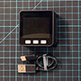 | マイコン | [スイッチサイエンス](https://www.switch-science.com/catalog/3647/) | |
| 2 | M5Stack用環境センサユニット ver.2 (ENV II)  | 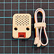 | 温度湿度 | [スイッチサイエンス](https://www.switch-science.com/catalog/6344/) | |
| 3 | M5Stack用ToF測距センサユニット | 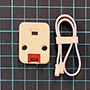 | 通過 | [スイッチサイエンス](https://www.switch-science.com/catalog/5219/) | |
| 4 | マグネット ドアスイッチ | 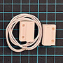 | 車輪 | [千石電商](https://www.sengoku.co.jp/mod/sgk_cart/detail.php?code=EEHD-0P6V) | |
| 5 | M5Stack用重さユニット (HX711) | 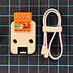 | 体重 | [スイッチサイエンス](https://www.switch-science.com/catalog/3647/) | |
| 6 | ロードセル シングルポイント (ビーム型)　２ｋｇ | 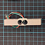 | 体重 | [秋月電子](http://akizukidenshi.com/catalog/g/gP-13041/) | |
| 7 | スイッチングＡＣアダプター | 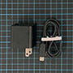 | 電源 | | |
| 8 | M5Stack用Port A (I2C) 拡張ハブユニット | 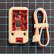 | I2Cハブ | [スイッチサイエンス](https://www.switch-science.com/catalog/5698/) | |
| 9 | M5Stack用PIRセンサユニット | 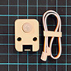 | モーション | [スイッチサイエンス](https://www.switch-science.com/catalog/5697/) | |
| 10 | GROVE互換ケーブル | 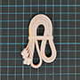 | 配線 | [スイッチサイエンス](https://www.switch-science.com/catalog/5215/) | |
| 11 | 延長用単線 IV0.65 | 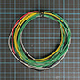| 配線 | | |
| 11 | 延長コネクタ WF-2BP | 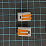| 配線 | [モノタロウ](https://www.monotaro.com/p/5514/0225/) | |
| 12 | microSDカード | 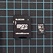 | 外部メモリ |  | |

<br><br><br><br>

## ２.部品の接続

### 環境センサとToF測距センサ
環境センサで、温度と湿度を計測、
ToF測距センサでお部屋の出入りをカウントします。


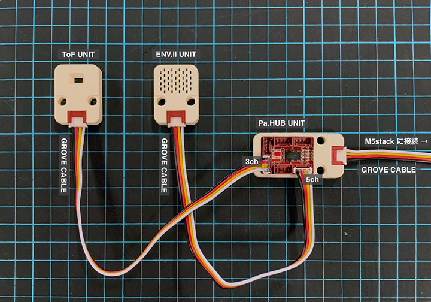 
1. 環境センサ(ENV.II UNIT)と、GROVEケーブルを繋ぎます。  

1. 繋いだGROVEケーブルとをPa.HUBのch5に繋ぎます。  

1. ToF測距センサ(ToF UNIT)と、GROVEケーブルを繋ぎます。  

1. 繋いだGROVEケーブルをPa.HUBのch3に繋ぎます。  

1. Pa.HUBとM5StackをGROVEケーブルで繋ぎます  

<br><br>

### 重さセンサ
重さセンサで、体重を測ります。

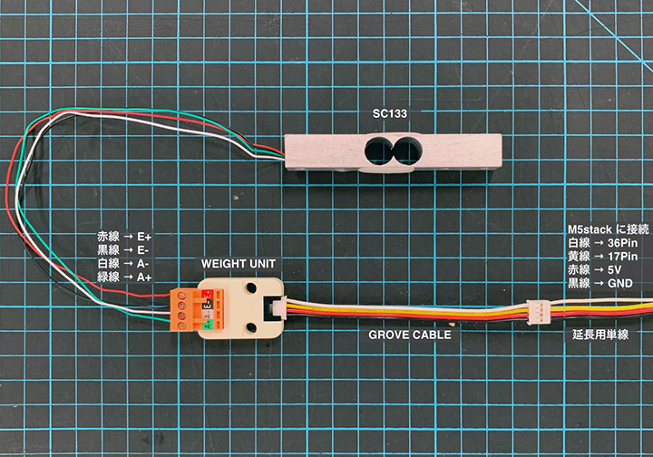 

1. ロードセル(SC133)のケーブルを、重さユニット HX711(WEIGHT UNIT)に繋ぎます。  

1. 重さユニット HX711とGROVEケーブルを繋ぎます。 

1. 延長用単線の赤、黒、白、黄色を用意し皮膜を剥きます。  

1. GROVE端子の白と単線の白、GROVE端子の黄色と単線の黄色、GROVE端子の赤と単線の赤、GROVE端子の黒と単線の黒を繋ぎます。  


1. 単線の赤をM5Stackの側面ピンの5Vへ、 単線の黒をM5Stackの側面ピンGNDへ、単線の白をM5Stackの側面ピン36へ繋ぎます。  
<br><br>

### マグネット ドアスイッチ
付属の磁石を判定することができます。今回はこれを車輪に取り付けることで回転数を計測します。


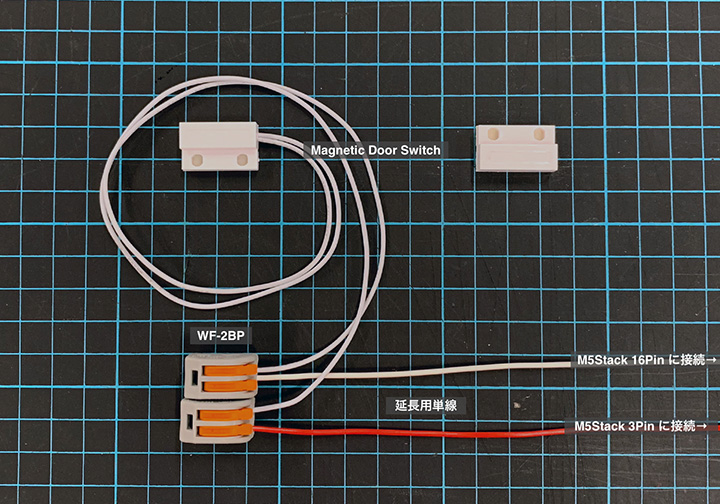 

1. 延長用単線の白と黒を用意し皮膜を剥きます。  

1. 各延長コネクタ(WF-2BP)と単線の白、赤を繋ぎます。  

1. 単線白を、M5Stackの側面ピン3へ、単線の黒を、M5Stackの側面ピン16へ繋ぎます。  

<br><br>

### PIRセンサ
動物の活動時間を計測します。

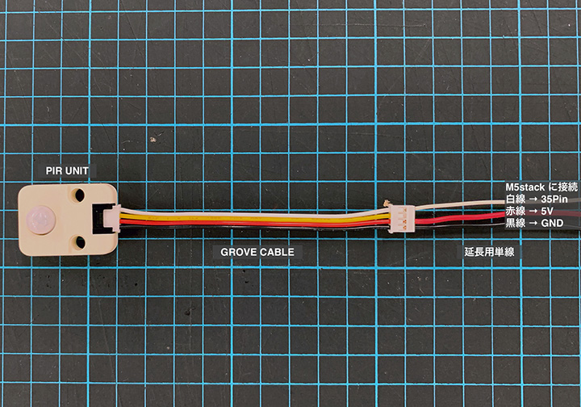 

1. PIRセンサユニット(PIR UNIT)とGROVEケーブルを繋ぎます。  

1. 延長用単線の赤、黒、白を用意し皮膜を剥きます。  

1. GROVE端子の白と単線の白、GROVE端子の赤と単線の赤、GROVE端子の黒と単線の黒を繋ぎます。  

1. 単線の赤をM5Stackの上部ピンの5Vへ、 単線の黒をM5Stackの上部ピンGNDへ、単線の白をM5Stackの側面ピン35へ繋ぎます。  

<br><br>


### M5STACKへの接続
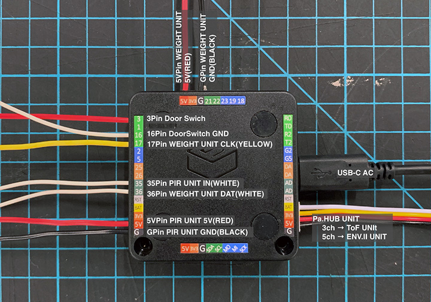 


<br><br>
## ピン配列
#### 上部ピン
| NO | ピン番号 | ピン名 | 接続ユニット | 項目 | 備考 |
|:--|:--|:--|:--|:--|:--|
| 1 | 5V | 5V | PIRセンサ | 5V | |
| 2 | 3V3 | 3V3 |  |  | |
| 3 | GND | GND | PIRセンサ | GND | |
| 4 | 21 | SDA |  |  | なにか接続すると起動しなくなるので使用しない (GROVE A SDA)|
| 5 | 22 | SCL |  |  | なにか接続すると起動しなくなるので使用しない (GROVE A SCL)|
| 6 | 23 | MO |  |  |  データが取得できない (SD MOSI)|
| 7 | 19 | MI |  |  | データが取得できない (SD MISO) |
| 8 | 18 | SCK |  |  | なにか接続するとSDカードが読まなくなるので使用しない(SD CLK) |

#### 側面ピン
| NO | ピン番号 | ピン名 | 接続ユニット | 項目 | 備考 |
|:--|:--|:--|:--|:--|:--|
| 1 | 3 | R0 | ドアスイッチ | 端子1 | |
| 2 | 1 | T0 |  |  | |
| 3 | 16 | R2 | ドアスイッチ | 端子2 | |
| 4 | 17 | T2 | weight | CLK | |
| 5 | 2 | G2 |  |  | なにか接続すると書き込みができなくなるで使用しない|
| 6 | 5 | G5 |  |  | なにか接続すると書き込みができなくなるで使用しない |
| 7 | 25 | DA |  |  | スピーカーと競合するので使わない |
| 8 | 26 | DA | | | |
| 9 | 35 | AD | PIRセンサ | OUT | |
| 10 | 36 | AD | weight | DATA | |
| 11 | RST | RST | | | |
| 12 | BAT | BAT | | | |
| 13 | 3V3 | 3V3 | | | |
| 14 | 5V | 5V | weight | 5V | |
| 15 | G | G | | weight | GND |


#### GROVE
| NO | ピン番号 | ピン名 | 接続ユニット | 項目 | 備考 |
|:--|:--|:--|:--|:--|:--|
| 1 | GROVE | GROVE端子 | Port A（I2C）拡張ハブユニット | | |


<br><br><br><br>


## 3.開発環境のダウンロードとインストール

https://M5Stack.com/pages/download 

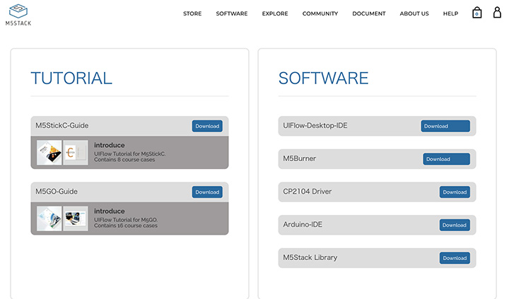

1. arduino IDEダウンロードし、続けてインストールしてください。   
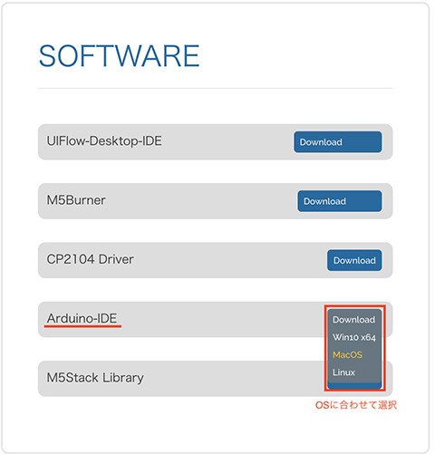
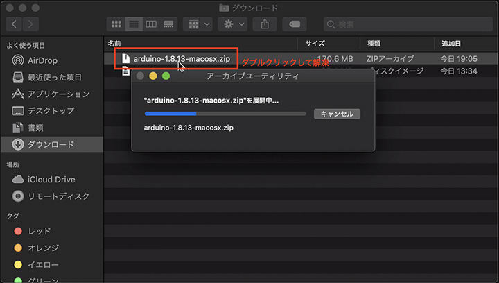

1. M5Stack.comからUSBドライバをダウンロードし、続けてインストールしてください。  
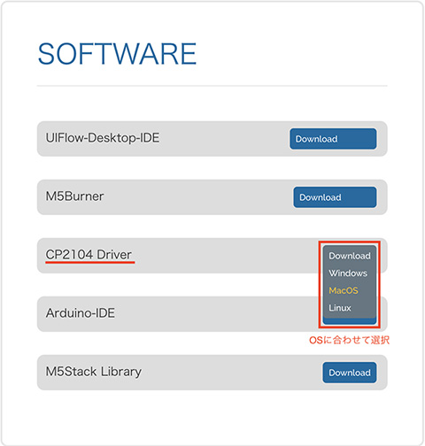
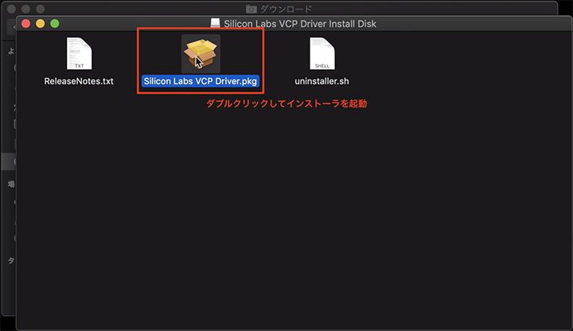

<br><br><br><br>

## 4.ライブラリをダウンロードとインストール

1. "設定" → "追加のボードマネージャーのURL"に「https://raw.githubusercontent.com/espressif/arduino-esp32/gh-pages/package_esp32_index.json」と入力  
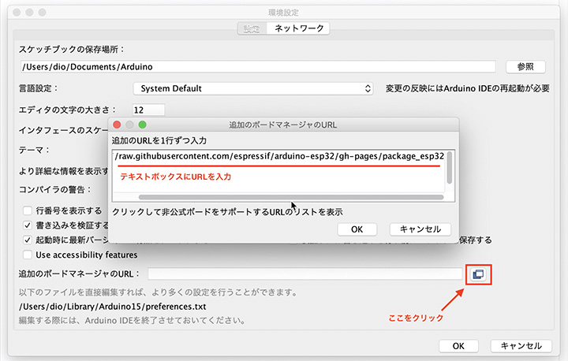

1. "ツール" → "ボードマネージャ"「esp32」と検索して「esp32 by Espressif Systems」をインストール  
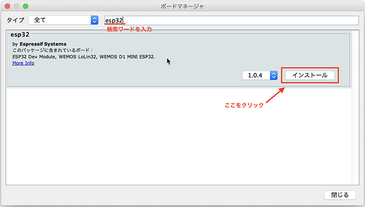

1. ”スケッチ” → "ライブラリを管理"「M5Stack」と検索して「M5Stack by M5Stack」をインストール  
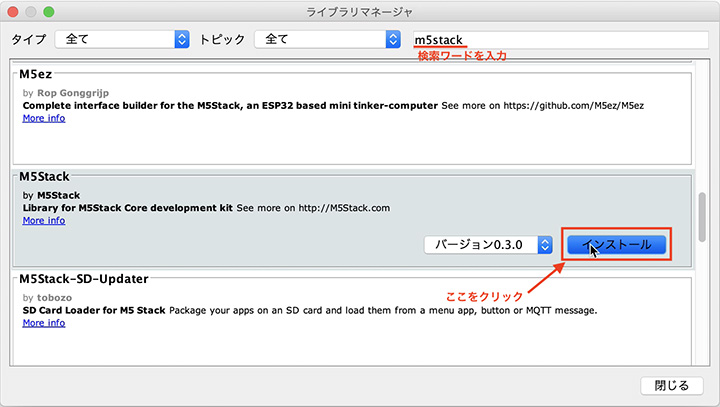


1. ”スケッチ” → ”ライブラリを管理”「ambient」と検索して「Ambient ESP32 ESP8266 lib」をインストール　　https://ambidata.io/docs/esp8266/#library_import  
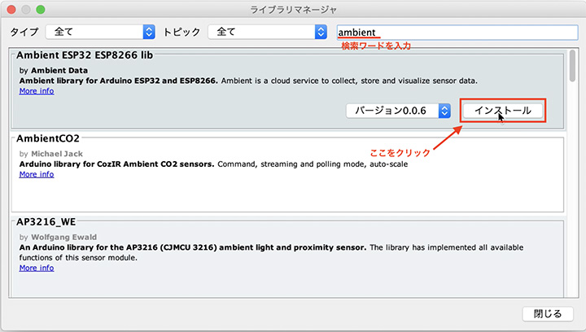

1. ”スケッチ” → ”ライブラリを管理”「csv」と検索して「CSV Parser」をインストール　https://github.com/michalmonday/CSV-Parser-for-Arduino  
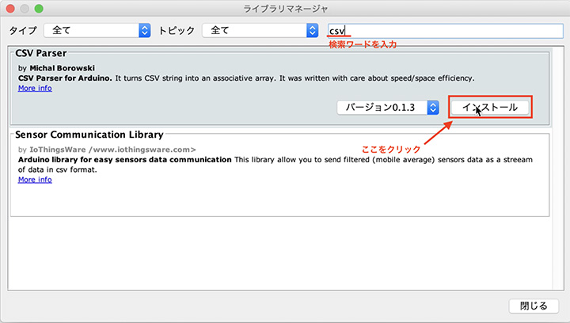

1. ”スケッチ” → ”ライブラリを管理”「VL53L0X」と検索して「VL53L0X by Pololu」をインストール  
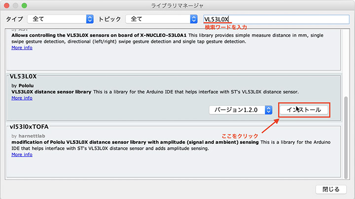


<br><br><br><br>

## 5.ファームウエアをダウンロード
https://github.com/panasonic-corporation/doingio-small-pets-healthcare

<br><br><br><br>

## 6.外部サービスとの連携
注）連携しない場合は、Config.hの設定でOFFにすることができます。その場合は下記登録は不要です。

### ambentユーザー登録から、チャンネルIDとライトキーの取得
<br>
https://ambidata.io/  
<br><br>


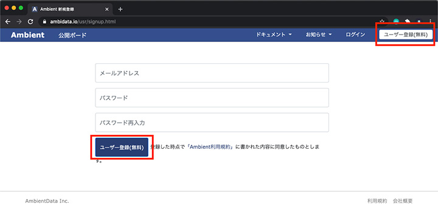
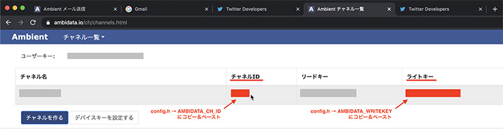

<br><br>

### Arduinoのツイートライブラリの登録から、tokenを取得  
<br>  
http://arduino-tweet.appspot.com/  
<br><br>

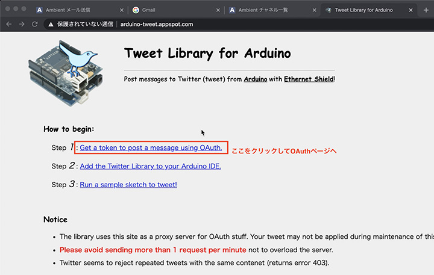
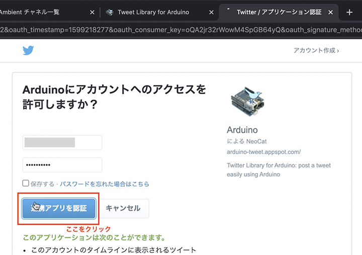
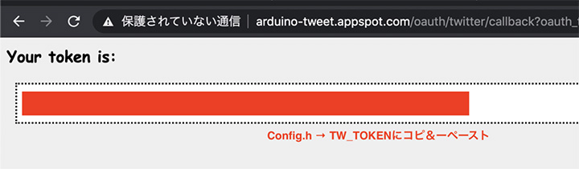


<br><br><br><br>


## 7.Config.hの設定


inoファイルをダブルクリックします。

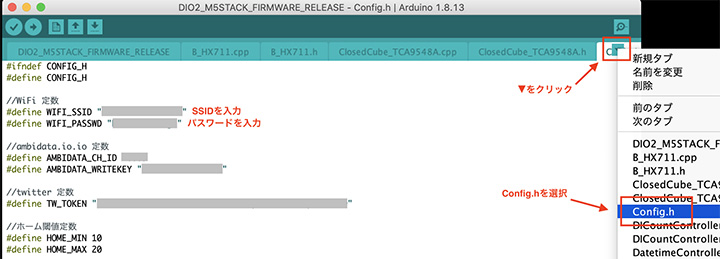

1. Arduino IDEでConfig.hを選びます。

1. wifi設定  

1. ambent設定  

1. twitter設定  

<br><br><br><br>

## 8.microSDカードの準備
microSDカードにFaceデータとFontデータを書き込む・microSDカードを取り出してM5に差し込む  
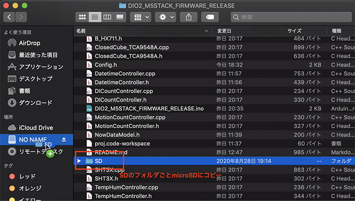

<br><br><br><br>

## 9.書き込み
1. M5StackとPCをUSB-Cケーブルで繋ぐ  

1. マイコンボードへの書き込み  


<br><br><br><br>

## 10.設置
1. 環境センサ設置  
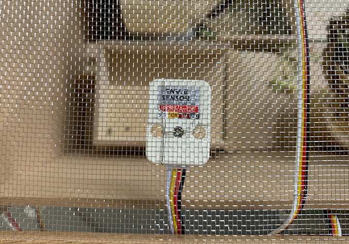

1. ToF測距センサ設置  
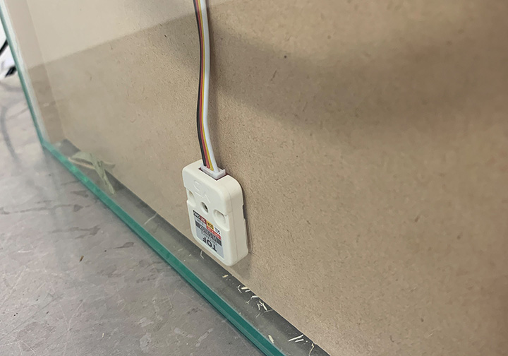

1. 重さセンサ設置  
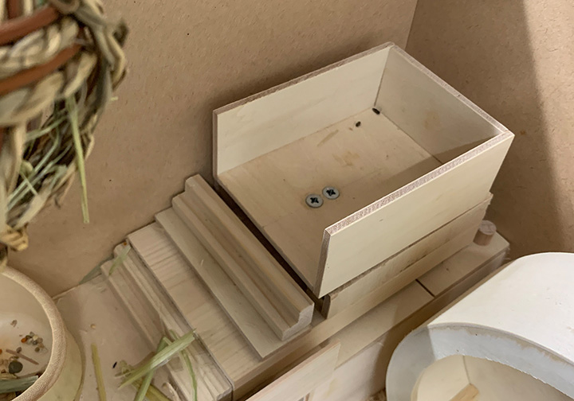

1. マグネット ドアスイッチ設置  
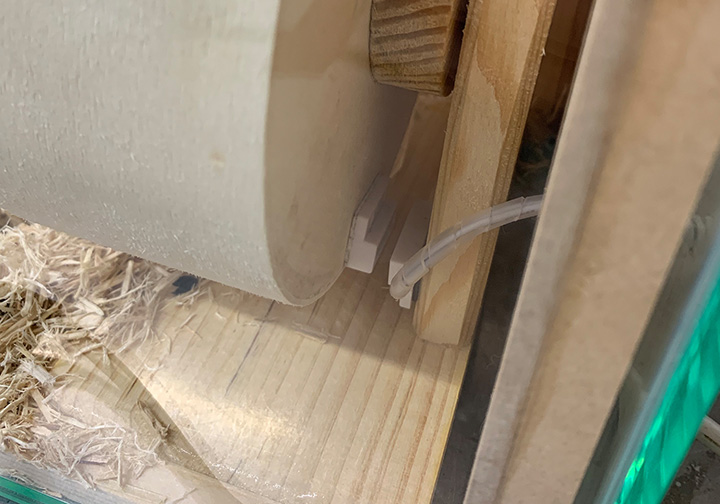

1. PIRセンサ設置  
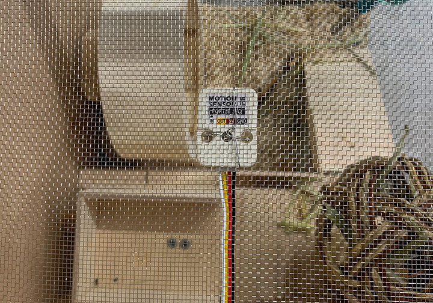

1. M5Stack設置、電源を接続  
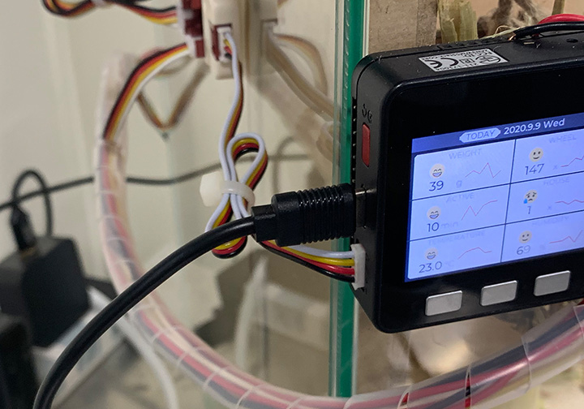


<br><br><br><br>

# カスタム
上記作り方が、ハムスターハウスの例での製作となりますが、
そこまでセンサーを必要としない場合のカスタム例です。

温度、湿度、体重、活動量のみのを取得し、外部連携をしない場合の例です。
センサは、環境センサ、重さセンサ、PIRセンサの三つを接続します。
「Config.h」は以下のよう変更します。 

```
// ambidata.io設定値
#define AMBIDATA_CH_ID -1 // AmbientのチャネルID 連携しない場合は-1を設定
#define AMBIDATA_WRITEKEY "" // ライトキー

//　Tweet Library for Arduino設定値 
#define TW_TOKEN "" //連携しない場合は""に設定


// UI表示設定値 ///////////////////////////////////////////////////////////

//表示レイアウト(1...6)
#define NUMBER_OF_SENSOR 4


//表示チャンネル1設定値
#define CH1 0               //表示チャネルインデックス(変更不可)
#define CH1_TITLE "WEIGHT"  //表示チャンネルのタイトル
#define CH1_GRAPH_MIN 0     //表示チャンネルグラフの最小値
#define CH1_GRAPH_MAX 200   //表示チャンネルグラフの最大
#define CH1_FS_MIN 10       //値によるFaceIcon閾値 SOSO範囲の最小　
#define CH1_FS_MAX 75       //値によるFaceIcon閾値 SOSO範囲の最大
#define CH1_FG_MIN 30       //値によるFaceIcon閾値 GOOD範囲の最小
#define CH1_FG_MAX 45       //値によるFaceIcon閾値 GOOD範囲の最大 それ以外はBAD値


//表示チャンネル2設定値
#define CH2 1
#define CH2_TITLE "ACTIVE"
#define CH2_GRAPH_MIN 0
#define CH2_GRAPH_MAX 500
#define CH2_FS_MIN 5
#define CH2_FS_MAX 100
#define CH2_FG_MIN 100
#define CH2_FG_MAX 99999


//表示チャンネル3設定
#define CH3 2
#define CH3_TITLE "TEMP"
#define CH3_GRAPH_MIN 0.0
#define CH3_GRAPH_MAX 50.0
#define CH3_FS_MIN 15
#define CH3_FS_MAX 28
#define CH3_FG_MIN 20
#define CH3_FG_MAX 26


//表示チャンネル4設定値
#define CH4 3
#define CH4_TITLE "HUM"
#define CH4_GRAPH_MIN 0
#define CH4_GRAPH_MAX 100
#define CH4_FS_MIN 40
#define CH4_FS_MAX 75
#define CH4_FG_MIN 45
#define CH4_FG_MAX 60


//表示チャンネル5設定値
#define CH5 4
#define CH5_TITLE ""
#define CH5_GRAPH_MIN 0
#define CH5_GRAPH_MAX 100
#define CH5_FS_MIN 5
#define CH5_FS_MAX 20
#define CH5_FG_MIN 20
#define CH5_FG_MAX 99999


//表示チャンネル6設定値
#define CH6 5
#define CH6_TITLE ""
#define CH6_GRAPH_MIN 0
#define CH6_GRAPH_MAX 100
#define CH6_FS_MIN 40
#define CH6_FS_MAX 75
#define CH6_FG_MIN 45
#define CH6_FG_MAX 60

```

続いて「SmallPetsHealthcare.ino」ファイルは以下のように変更します。 
```
 //--センサークラスをセットアップ
  weightController.setup(&nowDayData, CH1, WEIGHT_DOUT_PIN, WEIGHT_SLK_PIN, WEIGHT_THRESHOLD, WEIGHT_OUTVOL, WEIGHT_LOAD, WEIGHT_CALIB);
  ActiveCountController.setup(&nowDayData, CH2, MOTION_PIN);
  tempHumController.setup(&nowDayData, CH3, CH4);
  wheelCountController.setup(&nowDayData, NOCH, WHEEL_PIN1, WHEEL_PIN2, WHEEL_TIMECHAT);
  houseCountController.setup(&nowDayData, NOCH, HOME_THRESHOLD_MIN, HOME_THRESHOLD_MAX);
```

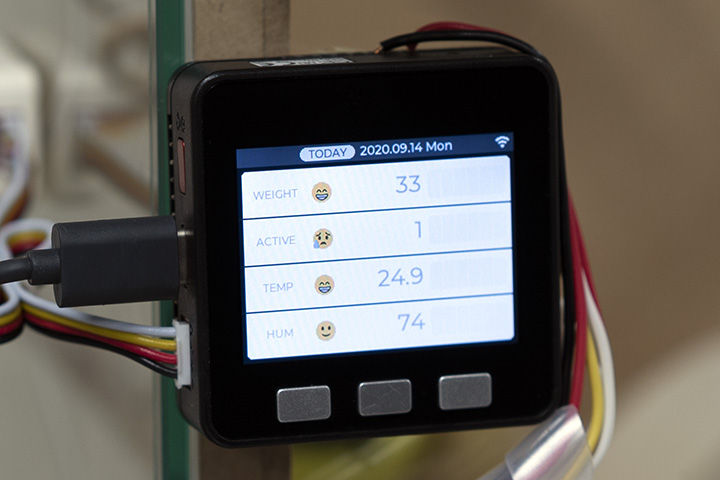


<br><br><br><br>

# FAQ
## 画面にフレームしか表示されない。
1. M5Stack側面の赤いボタンを一度押して再起動してください。
1. 解決しない場合は、USBケーブルを挿し直してください。

## 文字が極端に小さい、フェイスアイコンが表示されない
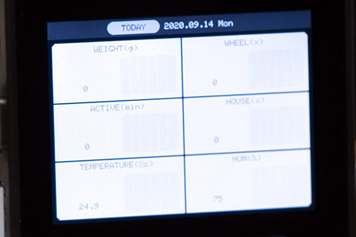

1. SDカードがうまく読み込めなかった可能性があります。ちゃんと刺さっているか確認してください。
1. M5Stack側面の赤いボタンを一度押して再起動してください。

<br><br><br><br>

# ライブラリ及びライセンス

| ライブラリ名| 配布元 | コピーライトまたは貢献者 | ライセンス |
|:---|:----|:----|:----|
| Twemoji | [URL](https://twemoji.twitter.com/) | Copyright (c) 2018 Twitter, Inc and other contributors | [LICENSE](https://github.com/twitter/twemoji/blob/master/LICENSE) |
| Montserrat(Google Fonts) | [URL](https://fonts.google.com/specimen/Montserrat#standard-styles) | [貢献者](https://github.com/JulietaUla/Montserrat/blob/master/CONTRIBUTORS.txt) | [LICENSE](https://fonts.google.com/specimen/Montserrat#license) |
| SHT3X | [URL](https://github.com/m5stack/M5Stack/tree/master/examples/Unit/ENVII_SHT30_BMP280) | Copyright (c) 2017 M5Stack | [LICENSE](https://github.com/m5stack/M5Stack/blob/master/LICENSE) |
| WifiTwitter | [URL](http://arduino-tweet.appspot.com/)<br>[URL](https://m5stack-build.hatenablog.com/entry/2020/02/27/234505) | Copyright (c) 2011 NeoCat | [LICENSE](https://github.com/NeoCat/Arduno-Twitter-library/blob/master/LICENSE.txt) |
| ClosedCube_TCA9548A | [URL](https://github.com/m5stack/M5StickC/tree/master/examples/Unit/PaHUB) | Copyright (c) 2020 M5Stack | [LICENSE](https://github.com/m5stack/M5StickC/blob/master/LICENSE) |

